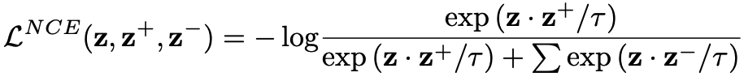
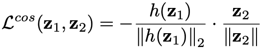

# [Leverage Your Local and Global Representations: A New Self-Supervised Learning Strategy](https://openaccess.thecvf.com/content/CVPR2022/papers/Zhang_Leverage_Your_Local_and_Global_Representations_A_New_Self-Supervised_Learning_CVPR_2022_paper.pdf)

This readme file is an outcome of the [CENG502 (Spring 2023)](https://ceng.metu.edu.tr/~skalkan/ADL/) project for reproducing a paper without an implementation. See [CENG502 (Spring 2023) Project List](https://github.com/CENG502-Projects/CENG502-Spring2023) for a complete list of all paper reproduction projects.

# 1. Introduction

The paper, namely "Leverage Your Local and Global Representations: A New Self-Supervised Learning Strategy" by Zhang et al., is published as a conference paper on CVPR 2022. It proposes a new self-supervised learning (SSL) strategy *_-LoGo-_* that can be adapted on top of existing SSL methods such as [MoCo](https://arxiv.org/abs/1911.05722) and [SimSiam](https://arxiv.org/abs/2011.10566).

This implementation focuses on what is referred to as *_SimSiam-LoGo_* in the paper, implying that the proposed technique is applied to SimSiam. The goal of this repository is to reproduce some of the results belonging to the section 4.2 of the paper: _"Training and evaluating the features"_.

## 1.1. Paper summary

A plethora of SSL methods rely on maximizing the similarity between representations of the same instance *(some further take negatives into account by methods such as large batch-sizes [] or queues [])*. These representations are aimed to be view-invariant, and thus origin from different views of the instance by applying random augmentations including random cropping.

These approaches are inherently limited by the fact that two random crops from the same image may be dissimilar, encoding different semantics. Pushing these features -regardless of the content- to be similar creates a bottleneck on the quality of the learned representations.

This paper addresses this problem by explicitly reasoning about the **Lo**cal and **G**l**o**bal views (crops) by:

1. Pulling global representations of the image together
2. Pulling local representations towards global representations of the image
3. Repelling local representations of the same image apart

# 2. The method and my interpretation

## 2.1. The original method

The method is aimed to be general, being applicable in both contrastive and non-contrastive scenarios. So, let's first do a quick review to lay the ground for the approach.

### 1. Similarity Loss

Similarity loss functions are used as objectives to maximize the similarity between two views. Two commonly used loss functions are:

1. Info-NCE [] loss (known as the contrastive loss), used by contrastive methods such as MoCo []:



Contrastive loss further accounts for the negatives, meaning that it pushes to minimize the similarity of the representation to the negatives, where negative samples may be drawn from the batch [], or from a queue [].

2. Cosine loss, used by non-contrastive methods such as SimSiam []:



where either stop-gradient operation is applied [] on z_2 branch or momentum encoder is used to obtain the representation z_2 [].

### 2. The Method

Given the complex image content of the contemporary datasets, the driving motivations behind this method are:

1. Two different crops of the same image may capture entirely different semantics
2. Two random crops from different images may capture similar semantics, conversely

Hence, it is _suboptimal_ to consider views as positive only if they originate from the same image. To address this, LoGo proposes two different kinds of crops, i) local crops, and ii) global crops.


## 2.2. Our interpretation 

@TODO: Explain the parts that were not clearly explained in the original paper and how you interpreted them.

# 3. Experiments and results

## 3.1. Experimental setup

@TODO: Describe the setup of the original paper and whether you changed any settings.

## 3.2. Running the code

```
conda create --name logo python=3.9
conda activate logo
```

```
pip install -r requirements.txt
```

### ImageNet100
```
python main.py --arch resnet34 --dataset imagenet100 --batch_size 384 --num_workers 16
```


## 3.3. Results

@TODO: Present your results and compare them to the original paper. Please number your figures & tables as if this is a paper.

# 4. Conclusion

@TODO: Discuss the paper in relation to the results in the paper and your results.

# 5. References

@TODO: Provide your references here.

# Contact

Erce Güder - guder.erce@metu.edu.tr
Ateş Aytekin - atesaytekinn@gmail.com